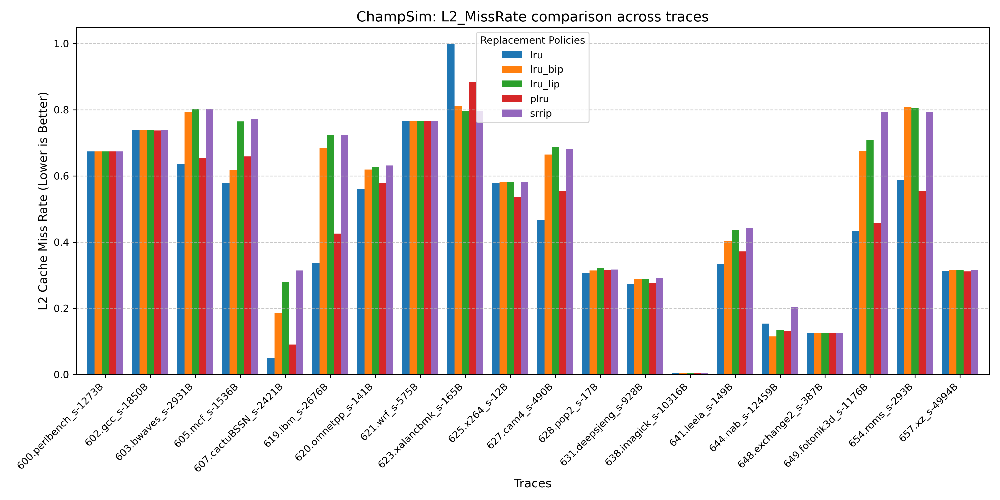

## GMean analysis

Aggregated results are these:

| policy   |   IPC_GMEAN |   L2_MR_GMEAN |
|:---------|------------:|--------------:|
| lru      |    0.907114 |       31.0901 |
| lru_bip  |    0.922373 |       36.6291 |
| lru_lip  |    0.924962 |       38.541  |
|   plru   | 0.920826    |       32.5989 |
| srrip    |    0.925209 |       39.7994 |

As seen from table, LRU shows the lowest IPC and lowest L2_MR at the same time. Other policies show results similar to each other significantly higher than LRU: ~0.923 vs 0.907 (1.7% higher). This means that LRU is worse than other cache algorithms even if it has the lowest missrate. The reason is that LRU stores unneeded data after it was accessed once in a big period of time. At the same time other policies try to handle these cases and keep only useful data that is accessed often. The "paradox" of higher number of misses and lower IPC can be solved by remembering that CPU is Out-of-Order and when (somewhat lower) number of misses is encountered sequentially, CPU can not do anything but to wait for each of them one after another. If cache can avoid these patterns it may have higher miss rate but higher IPC by doing requests to memory in parallel.

## Per-trace analysis

Most traces have indistinguishable IPC difference. 

- 607.cactuBSSN_s has unordinary results that LRU is the best. Most likely it has high temporal locality, data fits entirely in cache or there is little data noise. 
- 654.roms_s-293B is slightly slower for LRU
- 623.xalancbmk_s is a lot slower for LRU and PLRU. Probably cache is polluted a lot by new data. Probably this benchmark has a cyclic scan pattern or some random-like pattern of access which pollute cache a lot and other policies handle well.

Again, a lot of traces have indistinguishable results but their number is lower.

- 623.xalancbmk_s has very high missrate which proves theory about "bad" pattern for LRU
- For most other traces with distinguishable results, LRU and PLRU missrate is a lot lower than SRRIP, LRU+LIP, LRU+BIP. It may mean that for a lot of tasks, LRU and PLRU are more energy-efficient since IPC is the same but missrate is lower.
