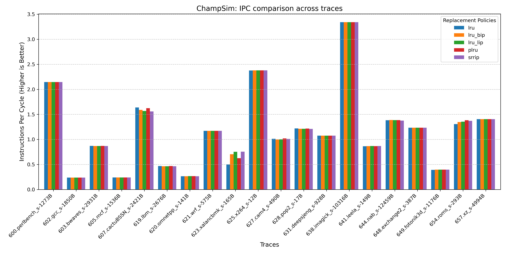
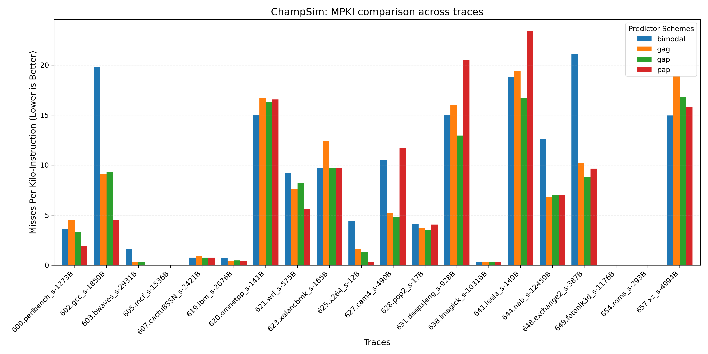

## GMean analysis

| Predictor   |   IPC_GMEAN |   MPKI_GMEAN |
|:------------|------------:|-------------:|
| bimodal     |    0.907114 |      2.32189 |
| gag         |    0.943871 |      1.78654 |
| gap         |    0.963648 |      1.61288 |
| pap         |    0.950324 |      1.23228 |

As seen from GMean stats, bimodal as the simplest predictor shows the worst IPC and MPKI. GAg as the second simplest show the second worst IPC and MPKI. This is caused by having lots of different branches interfere with each other making results worse. GAp and PAp have similar IPC with GAp slightly winning (1.3%) but MPKI is vice versa: GAp's MPKI is much worse (30%). Reason may be that some branch mispredictions are worse than others and PAp handles them poorly. But since total budget is limited and PAp requires big history table (10k bits instead of just 10 bits for GAp), its table with state machines is much smaller (32k bits vs 16k bits). Also GAp may remember correlated branches that depend on each other which may be more expensive branches.

## Per-trace analysis

For around half of traces, IPC difference is indistinguishible. For most others, trend is the same as in GMean. 

- 5 traces have PAp worse than GAp
- 5 traces have PAp better than GAp
- 1 trace has bimodal the best
- no traces have GAg significantly better than GAp

For MPKI, trend is generally the same as for IPC

- bimodal is the worst except for one trace where it is the best
- Sometimes GAp is better than PAp, sometimes vice versa.
- GAg is worse than GAp

